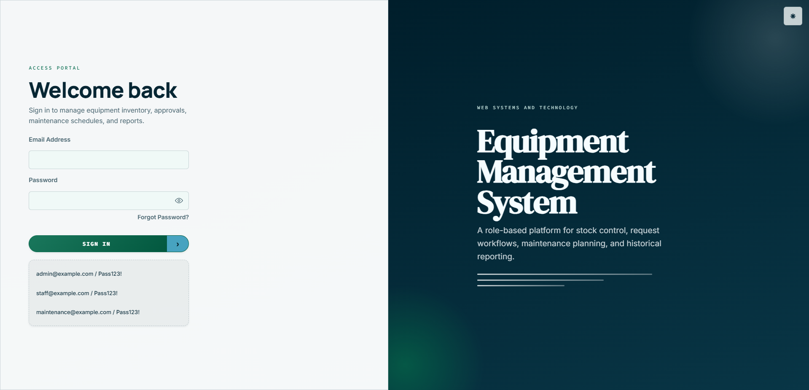
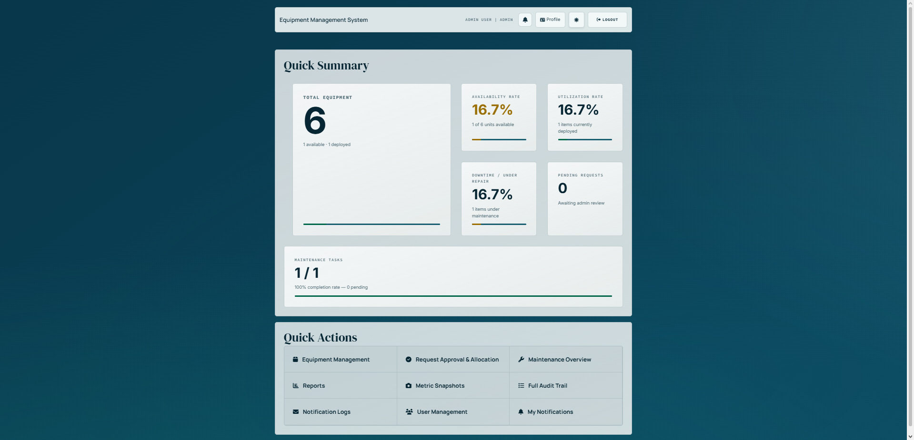
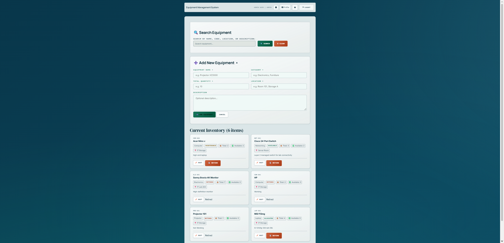
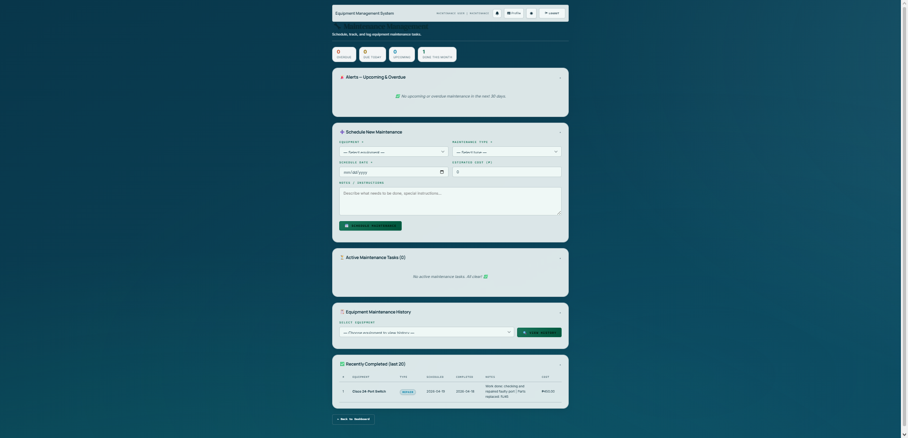
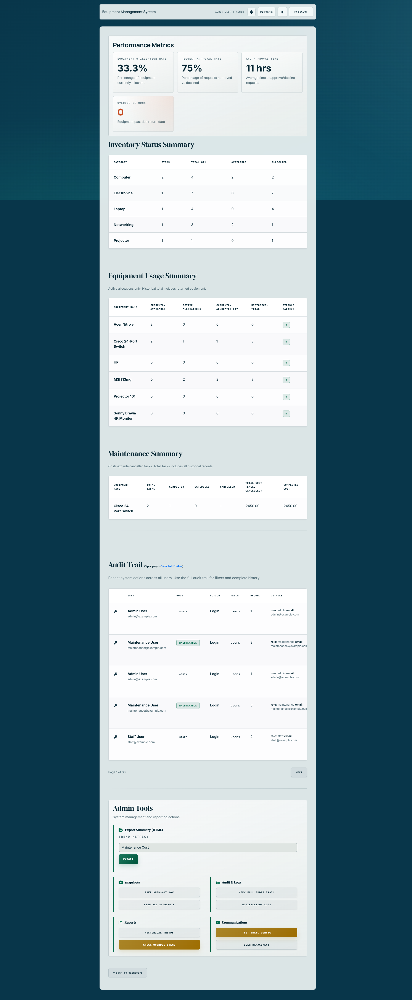

# Web-Based Equipment Management System

---

## Description

The **Web-Based Equipment Management System** is a role-based web application designed to streamline the management of equipment within an organization. It enables different types of users — administrators, staff, and maintenance personnel — to interact with the system according to their roles.

The system covers the full equipment lifecycle: from inventory tracking and staff requests, to admin approvals and allocations, all the way through maintenance scheduling and reporting. It is built as a lightweight, server-rendered web app deployed on Vercel.

---

## Features

- **Role-Based Access Control** — Separate dashboards and permissions for `admin`, `staff`, and `maintenance` roles
- **User Authentication** — Secure login using database-backed credential validation with hashed passwords
- **Equipment Inventory Management** — Admins can view, add, and manage all equipment records
- **Request & Allocation Workflow** — Staff can submit equipment requests; admins can approve, reject, or allocate
- **Maintenance Scheduling** — Maintenance personnel can schedule and mark completion of maintenance tasks
- **Reporting** — Admin-accessible reports covering inventory status, usage history, and maintenance summaries
- **Session Security** — Server-side role enforcement with PHP sessions; identity is never derived from client input
- **Responsive UI** — Mobile-friendly design with a dark tonal design system (glass/blur panels, glowing buttons, status chips)

---

## Technologies Used

| Technology | Purpose |
|---|---|
| PHP 8+ | Server-side logic and routing |
| PostgreSQL | Relational database for all application data |
| Vercel + `vercel-php` | Hosting and PHP runtime |
| Vanilla JavaScript | Client-side confirmation UX |
| CSS (custom design system) | Styling with `Manrope`, `Inter`, and `Space Grotesk` fonts |

---

## Installation / Setup Guide

### Prerequisites

- PHP 8+ installed locally
- A PostgreSQL database instance
- Node.js (for the DB setup script)

### Steps

**1. Clone the repository**
```bash
git clone https://github.com/TaffyRaphy/projectIT211.git
cd projectIT211
```

**2. Configure your database**

Set your PostgreSQL connection string as an environment variable:
```bash
export DATABASE_URL=your_postgresql_connection_string
# or
export POSTGRES_URL=your_postgresql_connection_string
```

**3. Run the database setup**

This will apply the schema and seed default accounts:
```bash
npm run db:setup
```

**Default seeded accounts** (password for all: `Pass123!`):
| Role | Email |
|---|---|
| Admin | `admin@example.com` |
| Staff | `staff@example.com` |
| Maintenance | `maintenance@example.com` |

**4. Start the local server**
```bash
php -S localhost:8000
```

**5. Open in your browser**

Navigate to [http://localhost:8000](http://localhost:8000) and log in with any of the seeded accounts.

---

### Deployment on Vercel

1. Set framework preset to **Other**
2. Add `DATABASE_URL` to your Vercel environment variables
3. Deploy a preview build first — verify login, sessions, and role-gated routes
4. Promote to production once verified
5. ⚠️ Do **not** re-run the DB setup script against production data unless intentional

---

## Screenshots

> 📸 Screenshots will be added here. Place images in the `assets/` folder and reference them below.

```markdown





```
